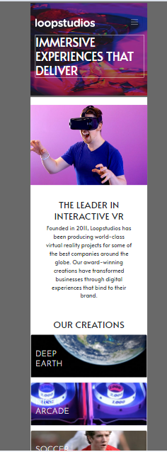

# Frontend Mentor - Loopstudios landing page solution

This is a solution to the [Loopstudios landing page challenge on Frontend Mentor](https://www.frontendmentor.io/challenges/loopstudios-landing-page-N88J5Onjw). Frontend Mentor challenges help you improve your coding skills by building realistic projects. 

## Table of contents

- [Overview](#overview)
  - [The challenge](#the-challenge)
  - [Screenshot](#screenshot)
  - [Links](#links)
- [My process](#my-process)
  - [Built with](#built-with)
  - [What I learned](#what-i-learned)
  - [Continued development](#continued-development)
  - [Useful resources](#useful-resources)
- [Author](#author)

## Overview

### The challenge

Users should be able to:

- View the optimal layout for the site depending on their device's screen size
- See hover states for all interactive elements on the page

### Screenshot



### Links

- Solution URL: [Github]()
- Live Site URL: [Live Github]()

## My process

### Built with

- Semantic HTML5 markup
- Sass/SCSS
- Bootstrap
- jQuery/Javascript
- Mobile-first workflow


### What I learned

- I could re-use code from a previous project (insure-landing-page-master) to help create the menu for mobile view.
- I used a different style media query , that's actually proper Bootstrap (example):
      `@include media-breakpoint-up(xxl) { ... }`
- use of picture element to interswitch the same picture at different sizes based on breakpoints.
- I started using VS Studio and it picked up some errors in my SCSS files that I've been using throughout (example):
         ```
        @media screen and(min-width:$container__form-xxl * 1px){
	        height: 400px;
	      }
        ```
        I do remember seeing this media query used in an online tutorial. 
- I'm following better and more CSS tutorials that exposed more of my beginner mistakes, for instance my use of 100vw/100vh and adding it to the body and html elements:
        ```
        body,html{
          width:100vw;
          height:100vh;
        }
        ```
- Had to use ::after to change the width for the links underlines

    ```
   a{
    @include font-color(map-get($colors,white),nth($fallback-colors,1));
    text-decoration:none;
    @include margin(0 15px 0 0);
    &:hover:not(.social-icons){
      cursor:pointer;
      &::after{
        content:'';
        position: relative;
        left:25%;
        width: 30px;
        display: block;
        height: 3px;
        background-color: map-get($colors,white);
      }
  
    }
   }
    ```
- I learned about image overlay in Bootstrap, in order to add the h3 titles ontop of the images.

### Continued development

- Daily tutorials and projects in HTML5, CSS3, Javascript, Bootstrap, Sass/SCSS. For now, in time I will go re-learn React ect.

### Useful resources
[How to change width of underline in css](https://stackoverflow.com/questions/43085144/how-to-change-width-of-underline-in-css)
[How to use image overlay correctly with Bootstrap](https://www.geeksforgeeks.org/how-to-use-image-overlay-correctly-with-bootstrap/)


## Author

- Website - [One of my latest codepens](https://codepen.io/cynthiab72/pen/oNybYON)
- Frontend Mentor - [@cmb347827](https://www.frontendmentor.io/profile/cmb347827)

